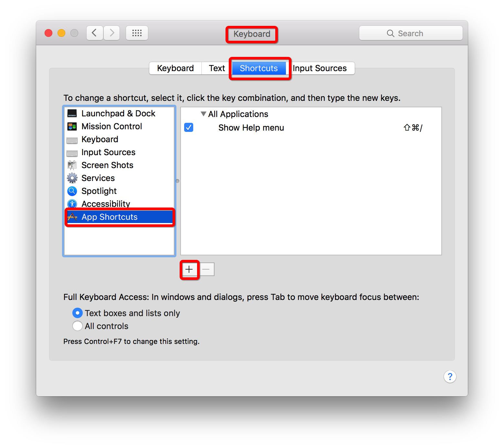
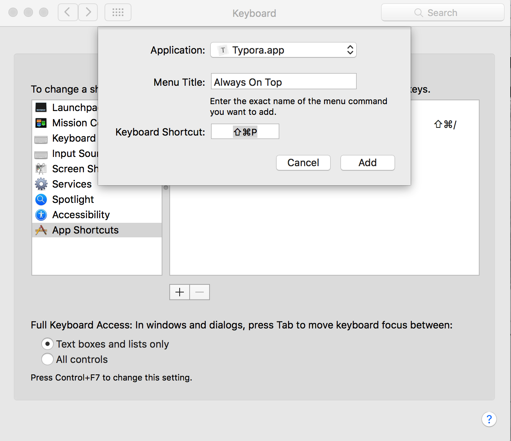
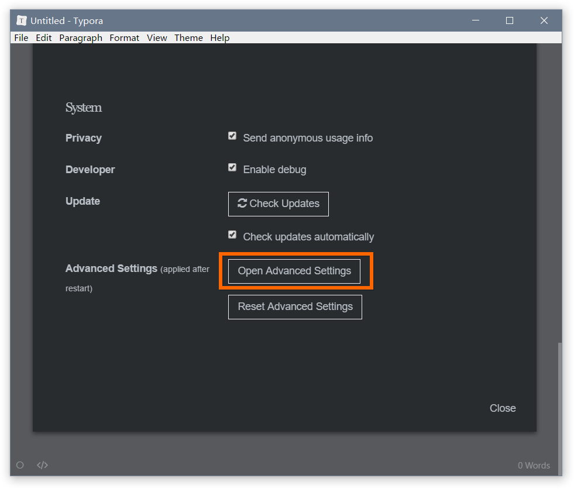
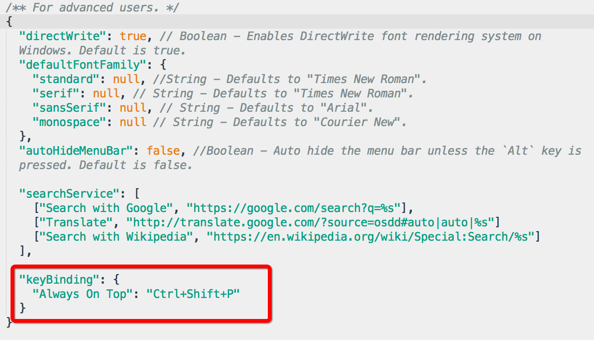
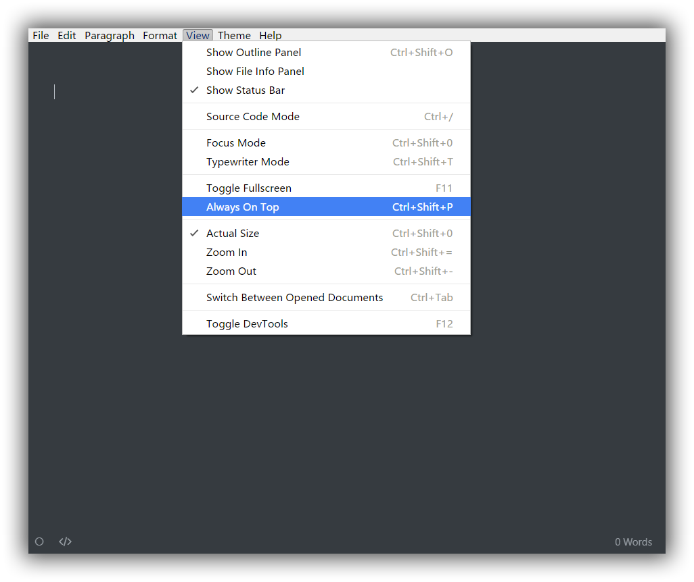

# MarkDown语法模板

# 功能快捷键：常用快捷键

### 自动完成

在 macOS 上，您可以`Esc`按键打开内联数学的内联预览、表情符号的自动完成等。

### 文件

| 功能               | 热键 (Windows/Linux) | 热键 (macOS)        |
| :----------------- | :------------------- | ------------------- |
| 新建               | Ctrl + N             | Command + N       |
| 新窗户             | Ctrl + Shift + N     | Command +Shift + N |
| 新标签             | *（不支持）*         | Command + T       |
| 打开               | Ctrl + O             | Command + O       |
| 快速打开           | Ctrl + P             | Command + Shift + O |
| 重新打开关闭的文件   | Ctrl + Shift + T     | Command + Shift + T |
| 保存               | Ctrl + S             | Command + S       |
| 另存为/复制        | Ctrl + Shift + S     | Command + Shift + S |
| 偏好设置           | Ctrl + ,             | Command + ,       |
| 关闭               | Ctrl + W             | Command + W       |

### 编辑

| 功能                                | 热键 (Windows/Linux)       | 热键 (macOS)                        |
| :---------------------------------- | :------------------------- | ----------------------------------- |
| 新段落                              | Enter                      | Enter                               |
| 换行                                | Shift + Enter              | Shift + Enter                       |
| 剪切                   | Ctrl + X                   | Command + X                         |
| 复制                                | Ctrl + C                   | Command + C                         |
| 粘贴                                | Ctrl + V                   | Command + V                         |
| 复制为 Markdown                     | Ctrl + Shift + C           | Command + Shift + C                 |
| 粘贴为纯文本                        | Ctrl + Shift + V           | Command + Shift + V                 |
| 全选                                | Ctrl + A                   | Command + A                         |
| 选择行/句子 选择行（在表格中）      | Ctrl + L                   | Command + L                         |
| 删除行（在表中）                    | Ctrl + Shift + Backspace   | Command + Shift + Backspace         |
| 选择样式范围 选择单元格（在表格中） | Ctrl + E                   | Command + E                         |
| 选择单词                            | Ctrl + D                   | Command + D                         |
| 删除单词                            | Ctrl + Shift + D           | Command + Shift + D                 |
| 跳到顶部                            | Ctrl + Home                | Command + ↑                         |
| 跳转到选择                          | Ctrl + J                   | Command + J                         |
| 跳到底部                            | Ctrl + End                 | Command + ↓                         |
| 查找                                | Ctrl + F                   | Command + F                         |
| 找下一个                            | F3 / Enter                 | Command + G / Enter                 |
| 查找上一个                          | Shift + F3 / Shift + Enter | Command + Shift + G / Shift + Enter |
| 替换                                | Ctrl + H                   | Command + H                         |

### 段落

| 功能         | 热键 (Windows/Linux)   | 热键 (macOS)              |
| :----------- | :------------------   | ------------------------- |
| 标题 1 至 6  | Ctrl + 1/2/3/4/5/6     | Command + 1/2/3/4/5/6   |
| 段落         | Ctrl + 0               | Command + 0             |
| 增加标题级别 | Ctrl + =               | Command + =             |
| 降低标题级别 | Ctrl + -               | Command + -             |
| 表格         | Ctrl + T               | Command + Option + T  |
| 代码围栏     | Ctrl + Shift + K       | Command + Option + C  |
| 数学块       | Ctrl + Shift + M       | Command + Option + B  |
| 引用         | Ctrl + Shift + Q       | Command + Option + Q  |
| 有序列表     | Ctrl + Shift + [       | Command + Option + O  |
| 无序列表     | Ctrl + Shift + ]       | Command + Option + U  |
| 缩进         | Ctrl + [ / Tab         | Command + [ / Tab |
| 减少缩进     | Ctrl + ] / Shift + Tab | Command + ] / Shift + Tab |

### 格式

| 功能     | 热键 (Windows/Linux) | 热键 (macOS)        |
| :------- | :------------------- | ------------------- |
| 加粗   | Ctrl + B             | Command + B       |
| 强调     | Ctrl + I           | Command + I     |
| 强调     | Ctrl + U             | Command + U       |
| 代码     | Ctrl + Shift + ` |Command + Shift +|
| 罢工     | Alt + Shift + 5      | Control + Shift + ` |
| 超链接   | Ctrl + K             | Command + K       |
| 图片     | Ctrl + Shift + I | Command + Control + I |
| 清除格式 | Ctrl + \             | Command + \       |

### 视图

| 功能                 | 热键 (Windows/Linux) | 热键 (macOS)          |
| :------------------- | :------------------- | --------------------- |
| 切换侧边栏           | Ctrl + Shift + L     | Command + Shift + L   |
| 大纲                 | Ctrl + Shift + 1     | Command + Control+ 1  |
| 文章                 | Ctrl + Shift + 2     | Command + Control + 2 |
| 文件树               | Ctrl + Shift + 3     | Command + Control + 3 |
| 源代码模式           | Ctrl + /             | Command + /           |
| 对焦模式             | F8                   | F8                    |
| 打字机模式           | F9                   | F9                    |
| 切换全屏             | F11                  | Command + Option + F  |
| 实际尺寸             | Ctrl + Shift + 0     | *（不支持）*          |
| 放大                 | Ctrl + Shift + =     | *（不支持）*          |
| 缩小                 | Ctrl + Shift + -     | *（不支持）*          |
| 在打开的文档之间切换 | Ctrl + Tab           | Command + `           |
| 切换开发工具         | Ctrl + Shift + I     | -                     |

## 更改快捷键

用户可以在 Typora 的菜单栏中设置或重新分配命令的快捷键。本文将展示如何做到这一点。

### 苹果系统

我们使用 macOS 的系统功能来自定义 Typora 在 macOS 上的键绑定。

1. 打开`System Preference`→ `Keyboard`，选择标签`Shortcuts`。`App Shortcuts`在其左侧面板中选择。

   

2. 点击“+”按钮，弹出对话框。从字段中选择“Typora.app” `Application`，然后输入您要添加的菜单Command的确切名称，然后输入您要分配的快捷键组合。

   例如，假设您要添加/更改固定 Typora 窗口的快捷键，您可以按如下方式填写对话框：

   

   然后`Command+Shift+P`将是菜单Command“always On Top”的快捷键

### 视窗/Linux

> 提示：这需要 Typora ≥ v0.9.16 的版本。

1. 在 Typora 中打开`Menu` → ，然后单击“打开高级设置”。`Preference`

   

2. `conf.user.json`从打开的“文件探索”中打开和编辑。如果没有这样的文件，请创建一个。

3. 设置或添加表示键绑定的 JSON 对象，例如：

   

4. 重新启动 Typora，将应用新的键绑定。

   

您可以在原生窗口样式的菜单栏中设置或更改菜单项的快捷键。

#### 问：快捷键在 Ubuntu 上不起作用

有关此问题的解决方案，请参阅：

- https://help.ubuntu.com/community/KeyboardShortcuts

- https://askubuntu.com/questions/208310/ctrl-a-doesnt-work-in-browsers。

  

  ---

# Typora 的 Markdown 语法

## 块元素

### 段落和换行符

段落只是一行或多行连续的文本。在 markdown 源代码中，段落由多个空行分隔。在Typora中，您只需按下 `Enter` 即可创建新段落。

按 `Shift` + `Enter` 可创建单个换行符。但是，大多数 markdown 解析器将忽略单行中断，要使其他 markdown 解析器识别您的换行符，可以在行尾留下两个空格，或者插入 `<br/>`

### 标题

标题在行的开头使用1-6个＃字符，对应于标题级别1-6。例如：

```markdown
# 这是一级标题

## 这是二级标题

###### 这是六级标题
```

在typora中，输入’＃’后跟标题内容，按下 `Enter` 键将创建标题。

### 引用文字

Markdown 使用电子邮件样式>字符进行块引用。它们表示为：

```markdown
> 这是一个有两段的块引用。这是第一段。
>
> 这是第二段。Vestibulum enim wisi, viverra nec, fringilla in, laoreet vitae, risus.


> 这是另一个只有一个段落的块引用。有三个空行分隔两个块引用。
```

在typora中，只需输入’>’后跟引用内容即可生成块引用。Typora将为您插入正确的“>”或换行符。通过添加额外级别的“>”允许在块引用内嵌入另一个块引用。

### 列表

输入 `* list item 1` 将创建一个无序列表，该 `*` 符号可以替换为 `+` 或 `-`.

输入 `1. list item 1` 将创建一个有序列表，其 markdown 源代码如下：

```markdown
## 无序列表
*   红色
*   绿色
*   蓝色

## 有序列表
1.  红色
2. 	绿色
3.	蓝色
```

### 任务列表

任务列表是标记为[ ]或[x]（未完成或完成）的项目的列表。例如：

```markdown
- [ ] 这是一个任务列表项
- [ ] 需要在前面使用列表的语法
- [ ] normal **formatting**, @mentions, #1234 refs
- [ ] 未完成
- [x] 完成
```

您可以通过单击项目前面的复选框来更改完成/未完成状态。

### （栅栏式）代码块

Typora仅支持 Github Flavored Markdown 中的栅栏式代码块。不支持 markdown 中的原始代码块。

使用栅栏式代码块很简单：输入```之后输入一个可选的语言标识符，然后按`Enter`键后输入代码，我们将通过语法高亮显示它：

~~~gfm
这是一个例子：

```
function test() {
  console.log("notice the blank line before this function?");
}
```

语法高亮：
```ruby
require 'redcarpet'
markdown = Redcarpet.new("Hello World!")
puts markdown.to_html
```
~~~

### 数学公式块

您可以使用 **MathJax** 渲染 *LaTeX* 数学表达式。

输入 `$$`, 然后按“Enter”键将触发一个接受*Tex / LaTex*源代码的输入区域。以下是一个例子：

 

在 markdown 源文件中，数学公式块是由’$$’标记包装的 *LaTeX* 表达式：

```latex
$$
\mathbf{V}_1 \times \mathbf{V}_2 =  \begin{vmatrix} 
\mathbf{i} & \mathbf{j} & \mathbf{k} \\
\frac{\partial X}{\partial u} &  \frac{\partial Y}{\partial u} & 0 \\
\frac{\partial X}{\partial v} &  \frac{\partial Y}{\partial v} & 0 \\
\end{vmatrix}
$$
```

### 表格

输入 `| First Header | Second Header |` 并按下 `Enter` 键将创建一个包含两列的表。

创建表后，焦点在该表上将弹出一个表格工具栏，您可以在其中调整表格，对齐或删除表格。您还可以使用上下文菜单来复制和添加/删除列/行。

可以跳过以下描述，因为表格的 markdown 源代码是由typora自动生成的。

在 markdown 源代码中，它们看起来像这样：

```markdown
| First Header  | Second Header |
| ------------- | ------------- |
| Content Cell  | Content Cell  |
| Content Cell  | Content Cell  |
```

您还可以在表格中包括内联 Markdown 语法，例如链接，粗体，斜体或删除线。

最后，通过在标题行中包含冒号：您可以将文本定义为左对齐，右对齐或居中对齐：

```markdown
| Left-Aligned  | Center Aligned  | Right Aligned |
| :------------ |:---------------:| -----:|
| col 3 is      | some wordy text | $1600 |
| col 2 is      | centered        |   $12 |
| zebra stripes | are neat        |    $1 |
```

最左侧的冒号表示左对齐的列; 最右侧的冒号表示右对齐的列; 两侧的冒号表示中心对齐的列。

### 脚注

```markdown
您可以像这样创建脚注[^footnote].

[^footnote]: Here is the *text* of the **footnote**.
```

将产生：

您可以像这样创建脚注[1](https://support.typoraio.cn/zh/Markdown-Reference/#fn:footnote).

鼠标移动到‘footnote’上标中查看脚注的内容。

### 水平线

输入 `***` 或 `---` 在空行上按 `Enter` 键将绘制一条水平线。

------

### YAML Front Matter

Typora 现在支持 [YAML Front Matter](http://jekyllrb.com/docs/frontmatter/) 。 在文章顶部输入 `---` 然后按 `Enter` 键将引入一个，或者从菜单中插入一个元数据块。

### 目录 (TOC)

输入 `[toc]` 然后按 `Enter` 键将创建一个“目录”部分，自动从文档内容中提取所有标题，其内容会自动更新。

### 图表 (Sequence, Flowchart and Mermaid)

Typora 支持, [sequence](https://bramp.github.io/js-sequence-diagrams/), [flowchart](http://flowchart.js.org/) and [mermaid](https://knsv.github.io/mermaid/#mermaid), 使用前要先从偏好设置面板启用该功能。

详细信息请参阅此 [文档](http://support.typora.io/Draw-Diagrams-With-Markdown/)

## Span 元素

在您输入后Span元素会被立即解析并呈现。在这些span元素上移动光标会将这些元素扩展为markdown源代码。以下将解释这些span元素的语法。

### 链接

Markdown 支持两种类型的链接：内联和引用。

在这两种样式中，链接文本都写在[方括号]内。

要创建内联链接，请在链接文本的结束方括号后立即使用一组常规括号。在常规括号内，输入URL地址，以及可选的用引号括起来的链接标题。例如：

```markdown
This is [an example](http://example.com/ "Title") inline link.

[This link](http://example.net/) has no title attribute.
```

将产生：

This is [an example](http://example.com/"Title") inline link. (`<p>This is <a href="http://example.com/" title="Title">`)

[This link](http://example.net/) has no title attribute. (`<p><a href="http://example.net/">This link</a> has no`)

#### 内部链接

**您可以将常规括号内的 href 设置为文档内的某一个标题**，这将创建一个书签，允许您在单击后跳转到该部分。例如：

Command(在Windows上：Ctrl) + 单击 [此链接](https://support.typoraio.cn/zh/Markdown-Reference/#块元素) 将跳转到标题 `块元素`处。 要查看如何编写，请移动光标或按住 `⌘` 键单击以将元素展开为 Markdown 源代码。

#### 参考链接

参考样式链接使用第二组方括号，在其中放置您选择的标签以标识链接：

```markdown
This is [an example][id] reference-style link.

然后，在文档中的任何位置，您可以单独定义链接标签，如下所示：

[id]: http://example.com/  "Optional Title Here"
```

在typora中，它们将呈现为：

This is [an example](http://example.com/) reference-style link.

隐式链接名称快捷方式允许您省略链接的名称，在这种情况下，链接文本本身将用作名称。只需使用一组空的方括号，例如，将“Google”一词链接到google.com网站，您只需写下：

```markdown
[Google][]
然后定义链接：

[Google]: http://google.com/
```

在typora中单击链接将其展开以进行编辑，command + 单击将在 Web 浏览器中打开超链接。

### URL网址

Typora允许您将 URL 作为链接插入，用 `<`括号括起来`>`。

`<i@typora.io>` 成为 [i@typora.io](mailto:i@typora.io).

Typora也将自动链接标准URL。例如： www.google.com.

### 图片

图像与链接类似， 但在链接语法之前需要添加额外的 `!` 字符。 图像语法如下所示：

```markdown


```

您可以使用拖放操作从图像文件或浏览器来插入图像。并通过单击图像修改 markdown 源代码。如果图像在拖放时与当前编辑文档位于同一目录或子目录中，则将使用相对路径。

有关图像的更多提示，请阅读 http://support.typora.io//Images/

### 强调（斜体）

Markdown 将星号 (`*`) 和下划线(`_`) 视为强调的指示。用一个 `*` or `_` 包裹文本将使用HTML `<em>` 标签包裹文本。例如：

```markdown
*单个星号*

_单个下划线_
```

输出：

*单个星号*

*单个下划线*

GFM将忽略单词中的下划线，这通常用在代码和名称中，如下所示：

> wow_great_stuff
>
> do_this_and_do_that_and_another_thing.

要在用作强调分隔符的位置生成文字星号或下划线，可以用反斜杠转义：

```markdown
\*这个文字被文字星号包围\*
```

Typora建议使用 `*` 号.

### 粗体

用两个 * 或 _ 包裹的文本将使用HTML `<strong>` 标签包裹，例如：

```markdown
**双星号**

__双重下划线__
```

输出：

**双星号**

**双重下划线**

Typora 建议使用 `**` 号。

### 代码

要指示代码范围，请使用反引号（`）进行包裹。与预格式化的代码块不同，代码跨度表示正常段落中的代码。例如：

```
使用`printf()`函数。
```

将产生：

使用 `printf()` 函数。

### 删除线

GFM通过添加语法来创建删除线文本，标准的Markdown中缺少该文本。

`~~错误的文字。~~` 变成 ~~错误的文字。~~

### 下划线

下划线由原始HTML提供支持。

`<u>下划线</u>` 变成 下划线

### 表情符号 :smile:

输入表情符号的语法是 `:smile:`

用户可以通过 `ESC` 按键触发表情符号的自动完成建议，或者在偏好设置面板里启用后自动触发表情符号。此外，还支持直接从 `Edit` -> `Emoji & Symbols` 菜单栏输入UTF8表情符号字符。

### 内联数学公式

要使用此功能，首先，请在 `偏好设置` 面板 -> `Markdown扩展语法` 选项卡中启用它。然后使用 `$` 来包裹TeX命令，例如： `$\lim_{x \to \infty} \exp(-x) = 0$` 将呈现为LaTeX命令。

要触发内联公式的预览提示功能：输入“$”, 然后按 `ESC` 键, 然后输入TeX命令, 预览工具提示将如下所示：


### 下标

要使用此功能，首先，请在 `偏好设置` 面板 -> `Markdown扩展语法` 选项卡中启用它。然后用 `~` 来包裹下标内容，例如： `H~2~O`, `X~long\ text~`/

### 上标

要使用此功能，首先，请在 `偏好设置` 面板 -> `Markdown扩展语法` 选项卡中启用它。然后用 `^` 来包裹上标内容，例如： `X^2^`。

### 高亮

要使用此功能，首先，请在 `偏好设置` 面板 -> `Markdown扩展语法` 选项卡中启用它。然后用 `==` 来包裹高亮内容，例如： `==highlight==`。

## HTML

您可以使用HTML来设置纯 Markdown 不支持的内容，例如， `<span style="color:red">this text is red</span>` 用于添加红色文本。

### 嵌入内容

有些网站提供基于iframe的嵌入代码，您也可以将其粘贴到Typora中，例如：

```Markdown
<iframe height='265' scrolling='no' title='Fancy Animated SVG Menu' src='http://codepen.io/jeangontijo/embed/OxVywj/?height=265&theme-id=0&default-tab=css,result&embed-version=2' frameborder='no' allowtransparency='true' allowfullscreen='true' style='width: 100%;'></iframe>
```

### 视频

您可以使用 `<video>` HTML标记嵌入视频，例如：

```Markdown
<video src="xxx.mp4" />
```

# 结束：

> 文章取自于Typora官网后制作整理，此文档仅便于个人学习使用。		2022-10-15：玄子