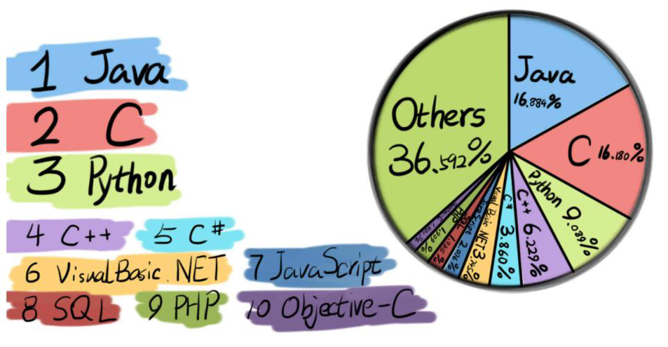
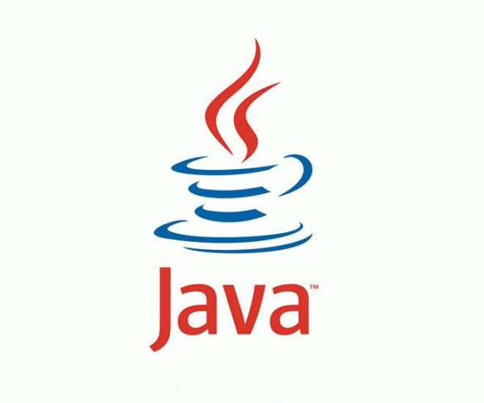
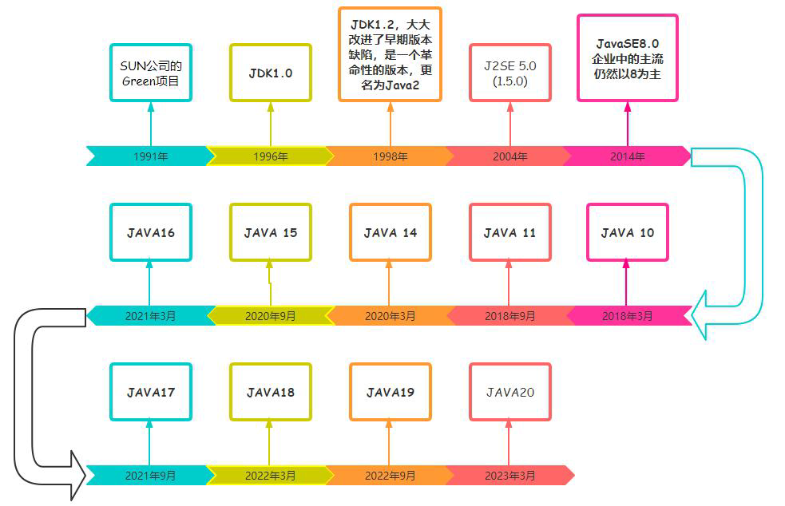
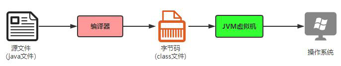
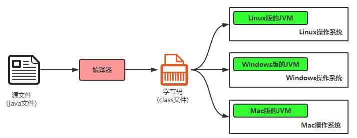
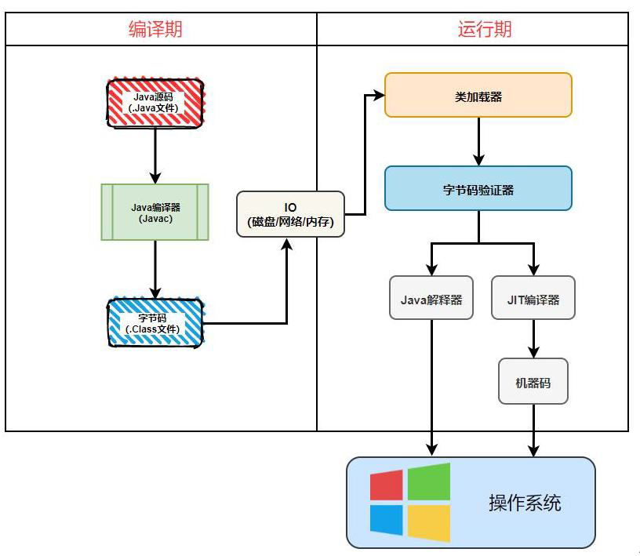
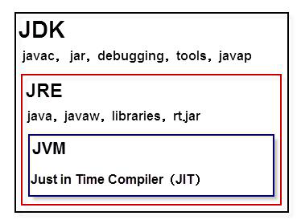
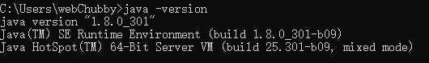

# 玄子学习笔记`2022年11月8日`

## 编程语言介绍

### C 语言

C 语言诞生于1972 年，现代高级语言的鼻祖，由著名的贝尔实验室发明。在底层编程，比如嵌入式、病毒开发等应用，可以替代汇编语言来开发系统程序。在高层应用，也可以开发从操作系统(Linux/Windows 都基于C 语言开发)到各种应用软件。

### C++语言

作为C 语言的扩展，C++是贝尔实验室于80 年代推出的。C++是一种混合语言，既可以实现面向对象编程，也可以开发C 语言面向过程风格的程序。C++语言在科学计算、操作系统、网络通讯、系统开发、引擎开发中仍然被大量使用。

### C#(c sharp)语言

C#是微软公司发布的一种面向对象的、运行于.NET Framework 之上的高级程序设计语言。

### JAVA介绍

#### JAVA发展史：

在1991年时候，James Gosling在sun公司的工程师小组想要设计这样一种小型计算机语言。该语言主要用于像电视盒这样的消费类电子产品，这些电子产品有一个共同的特点：计算处理能力和内存都非常有限。

所以要求：语言必须非常小且能够生成非常紧凑的代码，这样才能在这样的环境中执行。

另外，由于不同的厂商选择不同的CPU，因此，要求该语言不能和特定的体系结构绑在一起，要求语言本身是中立的，也就是跨平台的。

所以，将这个语言命名为“Green”，类似于绿色软件的意思。后来，改名将OAK。橡树的意思。改名后发现已经有一种语言叫这个名字了，再改名叫JAVA。

- 1991年，Sun公司的Green项目，Oak
- 1995年，推出Java测试版
- 1996年，JDK1.0

#### JAVA简介：

Java是一门面向对象编程语言，不仅吸收了C++语言的各种优点，还摒弃了C++里难以理解的多继承、指针等概念，因此Java语言具有功能强大和简单易用两个特征。Java语言作为静态面向对象编程语言的代表，极好地实现了面向对象理论，允许程序员以优雅的思维方式进行复杂的编程。

Java具有简单性、面向对象、分布式、健壮性、安全性、平台独立与可移植性、多线程、动态性等特点。Java可以编写桌面应用程序、Web应用程序、分布式系统和嵌入式系统应用程序等。

---

## 电脑快捷键

| 按键               | 说明       |
| ------------------ | ---------- |
| Ctrl + A           | 全选       |
| Ctrl + C           | 复制       |
| Ctrl + V           | 粘贴       |
| Ctrl + X           | 剪切       |
| Ctrl + Z           | 撤销       |
| Ctrl + Y           | 撤回       |
| Ctrl + S           | 保存       |
| Alt + F4           | 关闭窗体   |
| Windows + R        | 运行       |
| Windows + L        | 快速锁屏   |
| Windows + E        | 资源管理器 |
| Ctrl + Shift + ESC | 任务管理器 |

---

## DOS命令

### 打开CMD的方法

1. 开始+系统+命令提示符

2. Win键+R输入cmd 打开控制台（推荐使用）

3. 在任意的文件夹下面，按住shift键+鼠标右键点击，在此处打开命令行窗口

4. 资源管理器的地址栏前面加上cmd路径

   >  管理员方式运行：选择以管理员方式运行

### 常用DOS命令

| 命令                                                 | 说明                     | 备注             |
| ---------------------------------------------------- | ------------------------ | ---------------- |
| C:                                                   | 选择盘符                 | 盘符名称加冒号   |
| dir                                                  | 查看当前目录下的所有文件 |                  |
| cd /d  C:                                            | 盘符切换                 | Change Directory |
| cd  文件名\文件名                                    | 目录切换                 |                  |
| cd..                                                 | 返回上一级目录           |                  |
| cls                                                  | 清理屏幕                 | Clear Screen     |
| exit                                                 | 退出                     |                  |
| ipconfig                                             | 查看电脑IP               |                  |
| clac  计算器 mspaint  画图 notepad  记事本 | 打开程序                 |                  |
| ping 网址                                            | ping命令                 |                  |
| md 文件名                                            | 创建文件夹               | Make Directory   |
| cd> a.txt                                            | 创建文件                 | 注意文件后缀     |
| del  a.txt                                           | 删除文件                 | 注意文件后缀     |
| rd 文件名                                            | 移除目录                 | Remove Directory |

---

## 计算机语言发展史

### 一代语言

机器语言

- 我们都知道计算机的基本计算方式都是基于二进制的方式。

- 二进制：010111001010110010110100

- 这种代码是直接输入给计算机使用的，不经过任何的转换！

| 十进制 | 二进制 |
| :----: | :----: |
|   1    |   1    |
|   2    |   10   |
|   3    |   11   |
|   4    |  100   |
|   5    |  101   |
|   6    |  110   |
|   7    |  111   |
|   8    |  1000  |
|   16   | 10000  |
|   32   | 100000 |

  

### 二代语言

汇编语言

- 解决人类无法读懂机器语言的问题

- 指令代替二进制

目前应用：

- 逆向工程
- 机器人
- 病毒

### 三代语言

- 高级语言

- 大体上分为：**面向过程**和**面向对象**两大类。

- C语言是典型的面向过程的语言。C++、JAVA是典型的面向对象的语言。

各种语言：

- C 

- C++ 

- JAVA

- C#  

- Python

  > 编程语言鼻祖C语言 后有C++改良为面向对象语言  再有JAVA  
  >
  > C#是微软基于JAVA研发的`.NET`平台软件

---

## Java 发展史_三大版本含义_Java 核心优势

### Java 发展简史

1991 年，James Gosling 在SUN 公司想要设计这样一种小型计算机语言。该语言主要用于像电视盒这样的消费类电子产品，要求语言本身是中立的，也就是跨平台的。

Java 语言发展到今天经历了一系列的过程：

- 1991 年，SUN 公司的Green 项目，Oak
- 1995 年，推出Java 测试版
- 1996 年，JDK1.0
- 1998 年，JDK1.2，大大改 进了早期版本缺陷，是一个革命性的版本，更名为Java2。
- 2004 年，J2SE 5.0 (1.5.0) Tiger 老虎
- 2014 年，JavaSE8.0
- 2017 年，JAVA 9.0
- 2020 年3 月，JAVA14
- 2020 年9 月，JAVA15
- 2021 年3 月，JAVA16
- 2021 年9 月，JAVA17
- 2022 年3 月，JAVA18
- 2022 年9 月，JAVA19
- ...

> SUN 公司已经被oracle 公司收购，目前每半年更新一次java 的版本。但是，企业中的主流仍然以8 为主。对于初学者，JAVA8 以上都可以。

### Java 的核心优势

Java 为消费类智能电子产品而设计，但智能家电产品并没有像最初想象的那样拥有大的发展。然而90 年代，Internet 却进入了爆发式发展阶段，一夜之间，大家都在忙着将自己的计算机连接到网络上。这个时侯，遇到了一个大的问题。人们发现连接到Internet 的计算机各式各样，有IBM PC、苹果机、各种服务器等等，不仅硬件CPU 不同，操作系统也不同，整个的网络环境非常复杂。这个时候，程序员们希望他们编写的程序能够运行在不同的机器，不同的环境中，这需要一种体系中立的语言（即跨平台）。Java 的研发小组忽然发现他们用于小范围的语言也可以适应Internet 这个大环境。

**跨平台是Java 语言的核心优势，赶上最初互联网的发展，并随着互联网的发展而发展，建立了强大的生态体系，目前已经覆盖IT 各行业的“第一大语言”，是计算机界的“英语”。**虽然，目前也有很多跨平台的语言，但是已经失去先机，无法和Java 强大的生态体系抗衡。Java 仍将在未来几十年成为编程语言的主流。

### Java 各版本的含义

**JavaSE（Java Standard Edition）：标准版，定位在个人计算机上的应用**
这个版本是Java 平台的核心，它提供了非常丰富的API 来开发一般个人计算机上的应用程序，包括用户界面接口AWT 及Swing，网络功能与国际化、图像处理能力以及输入输出支持等。在上世纪90 年代末互联网上大放异彩的Applet 也属于这个版本。Applet 后来为Flash 取代，Flash 即将被HTML5 取代。

**JavaEE（Java Enterprise Edition）：企业版，定位在服务器端的应用**
JavaEE 是JavaSE 的扩展，增加了用于服务器开发的类库。如：JDBC 是让程序员能直接在Java 内使用的SQL 的语法来访问数据库内的数据；Servlet 能够延伸服务器的功能，通过请求-响应的模式来处理客户端的请求；JSP 是一种可以将Java 程序代码内嵌在网页内的技术；

**JavaME（Java Micro Edition）：微型版，定位在消费性电子产品的应用上**
JavaME 是JavaSE 的内伸，包含J2SE 的一部分核心类，也有自己的扩展类,增加了适合微小装置的类库：javax.microedition.io.*等。该版本针对资源有限的电子消费产品的需求精简核心类库，并提供了模块化的架构让不同类型产品能够随时增加支持的能力。

> 很多人开始会误解为安卓开发就是JavaME，这两个是完全不同的内容。

### Java 的特性和优势

- 跨平台/可移植性
          这是Java 的核心优势。Java 在设计时就很注重移植和跨平台性。比如：Java 的int 永远都是32 位。不像C++可能是16，32，可能是根据编译器厂商规定的变化。这样的话程序的移植就会非常麻烦。
- 安全性
          Java 适合于网络/分布式环境，为了达到这个目标，在安全性方面投入了很大的精力，使Java 可以很容易构建防病毒，防篡改的系统。
- 面向对象
          面向对象是一种程序设计技术，非常适合大型软件的设计和开发。由于C++为了照顾大量C 语言使用者而兼容了C，使得自身仅仅成为了带类的C 语言，多少影响了其面向对象的彻底性！Java 则是完全的面向对象语言。
- 简单性
            Java 就是C++语法的简化版，我们也可以将Java 称之为“C++-”。跟我念“C 加加减”，指的就是将C++的一些内容去掉；比如：头文件，指针运算，结构，联合，操作符重载，虚基类等等。同时，由于语法基于C 语言，因此学习起来完全不费力。
- 高性能
          Java 最初发展阶段，总是被人诟病“性能低”；客观上，高级语言运行效率总是低于低级语言的，这个无法避免。Java 语言本身发展中通过虚拟机的优化提升了几十倍运行效率。比如，通过JIT(JUST IN TIME)即时编译技术提高运行效率。将一些“热点”字节码编译成本地机器码，并将结果缓存起来，在需要的时候重新调用。这样的话，使Java 程序的执行效率大大提高，某些代码甚至接待C++的效率。因此，Java 低性能的短腿，已经被完全解决了。业界发展上，我们也看到很多C++应用转到Java 开发，很多C++程序员转型为Java 程序员。
- 分布式
          Java 是为Internet 的分布式环境设计的，因为它能够处理TCP/IP 协议。事实上通过URL 访问一个网络资源和访问本地文件是一样简单的。Java 还支持远程方法调用(RMI,Remote Method Invocation)，使程序能够通过网络调用方法。
  
- 多线程
          多线程的使用可以带来更好的交互响应和实时行为。Java 多线程的简单性是Java 成为主流服务器端开发语言的主要原因之一。
- 健壮性
          Java 是一种健壮的语言，吸收了C/C++ 语言的优点，但去掉了其影响程序健壮性的部分（如：指针、内存的申请与释放等）。Java 程序不可能造成计算机崩溃。即使Java 程序也可能有错误。如果出现某种出乎意料之事，程序也不会崩溃，而是把该异常抛出，再通过异常处理机制加以处理。

---

## Java 运行机制_JDK/JRE/JVM

### Java 程序的运行机制

1. Java 首先利用文本编辑器编写Java 源程序，源文件的后缀名为.java；

2. 再利用编译器（javac）将源程序编译成字节码文件，字节码文件的后缀名为.class；

3. 最后利用虚拟机（解释器，java）解释执行。如上图所示。

  > 计算机高级语言的类型主要有编译型和解释型两种，而Java 语言是两种类型的结合。

### JVM、JRE 和JDK

**JVM(Java Virtual Machine):** 用于执行bytecode 字节码的”虚拟计算机”。
**不同的操作系统有不同版本JVM，屏蔽了底层运行平台的差别，**是实现跨平台的核心。

**Java Runtime Environment (JRE) 包含：**Java 虚拟机、库函数等。
**Java Development Kit (JDK)包含：**JRE，编译器和调试器等。

> - 如果只是要运行Java 程序或者玩Minecraft 这样的JAVA 游戏，只需要JRE 就可以。JRE通常非常小，其中包含了JVM。
> - 如果要开发Java 程序，就需要安装JDK。

### JDK 下载和安装

- 下载JDK
  www.oracle.com/technetwork/java/javase/downloads/index.html

- 安装JDK 

  选择JDK 安装目录，采用默认即可（如果一定要自定义，不要包含中文路径）

### JDK 环境变量的配置

1. path 是一个常见的环境变量，它告诉系统除了在当前目录下寻找此程序外，还可以到
     path 指定的目录下寻找。

2. JAVA_HOME
  为以后其他软件寻找JDK 做准备！（一般建议进行配置）

3. classpath 不需配置!
  JDK1.5 以上版本，JRE 会自动搜索当前路径下的类文件及相关jar 文件。
  
  ### 测试JDK 安装成功
  
  在窗口中输入命令“java -version ”。出现如下结果，则说明JDK 安装成功。
  

## 编写第一个Java程序`Change The Word！`

- 使用记事本，编写代码

  ~~~java
  public class Welcome{
  	public static void main(String[] args){
  		System.out.println("Change The Word！");
  	}
  }
  ~~~

  
